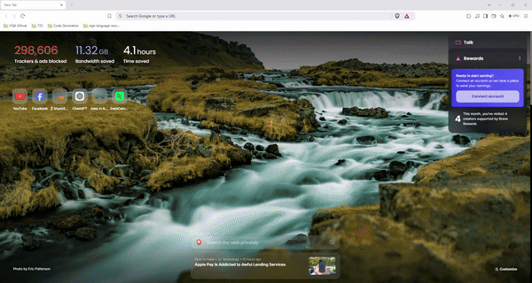

# Basic Chatbot 

A basic demonstration of a chatbot that integrates web scraping, Retrieval-Augmented Generation (RAG), Email Send and Internet Search using `beautifulsoup4`, `DuckDuckGo Search`, `Gemini`, `llama-index`, `SendGrid` and `streamlit`. 



How to run the project
---

## Step 1: Create a Python Virtual Environment

1. Create a virtual environment with the following command:

   ```bash
   python -m venv venv
   ```

2. Activate the virtual environment:
   - **On Windows**:
     ```bash
     venv\Scripts\activate
     ```
   - **On macOS/Linux**:
     ```bash
     source venv/bin/activate
     ```

---

## Step 2: Install Requirements

1. Install the required packages using pip:

   ```bash
   pip install -r requirements.txt
   ```

---

## Step 3: Run the `scrap.py` Script
1. Run the scraping script by using the following command:

   ```bash
   python scrap.py -u url_name -c class_name -e element_name
   ```

   The script will scrape the specified web pages and save the content into `.html` files in the designated directory. If no argument are passed then script will scrap using the default values listed in the `scrap.py` file.

---

## Step 4: Run the Chatbot

1. Run the chatbot using following command:

   ```bash
   streamlit run chatbot.py
   ```
---
